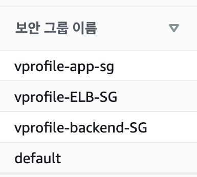

# devops-project

## 목차

- [01. Vagrant + VM(VirtualBox)](#01-vagrant--vmvirtualbox)
- [02. AWS Cloud for Web App Setup [Lift & Shift]](#02-aws-cloud-for-web-app-setup-lift-and-shift)

## 01. Vagrant + VM(VirtualBox)

<details>
<summary><b>접기/펼치기</b></summary>

### 🖍 Provisioning(프로비저닝)

"프로비저닝"이란 IT 인프라의 설정과 관리를 위한 프로세스를 말합니다. 이 과정은 소프트웨어 설치, 구성, 실행을 포함하며, 이러한 작업들은 수동으로 수행될 수 있지만 자동화된 툴을 통해 진행될 수도 있습니다.

#### 🕯 수동

vagrant file을 이용하여. VM생성, OS설치

[Manual Provisioning](<01.Vagrant+VM(VirtualBox)/Manual_Provisioning>)

#### 🔦 자동

vagrant file과 shellscript를 이용하여 VM생성, OS설치, APP설치, 설정을 자동화

[Automated Provisioning](<01.Vagrant+VM(VirtualBox)/Automated_Provisioning>)

### 🏗 설계


### ⛳️ 검증

<details>
<summary>접기/펼치기</summary>


</details>

### 📃 출처

#### 소스코드

- [devopshydclub/vprofile-project](https://github.com/devopshydclub/vprofile-project)

#### 내용

- [Udemy - DevOps Projects | 20 Real Time DevOps Projects](https://www.udemy.com/course/devopsprojects/)

### 🛠 스택

<p align="left">
  
  
   
   
   
</p>

</details>

## 02. AWS Cloud for Web App Setup [Lift & Shift]

<details>
<summary><b>접기/펼치기</b></summary>

이 프로젝트는 AWS 클라우드 컴퓨팅 프로젝트로, "리프트 앤 시프트 전략"을 사용해 AWS 클라우드로 애플리케이션을 이동하는 것을 목표로합니다.

### 🖍 Lift & Shift (리프트 앤 시프트)

"리프트 앤 시프트"는 기존의 온-프레미스 시스템을 클라우드로 그대로 이전하는 전략입니다.
이것은 "클라우드 마이그레이션"또는 "애플리케이션 재호스팅"이라고도 불립니다. 이 전략의 주요 목표는 클라우드의 이점을 신속하게 활용하면서 애플리케이션 코드나 데이터를 거의 변경하지 않는 것입니다.

### 🏗 설계

01에서 사용했던 스크립트를 이용하여, 리프트 앤 시프트 전략을 사용해 AWS 클라우드로 프로비저닝합니다.  
MySQL, RabbitMQ, Memcached를 하나의 보안 그룹으로 묶어 각각 인스턴스에 프로비저닝하고, Route 53을 이용해, 각각의 private IP를 이름으로 매핑합니다.  
app01 인스턴스를 생성하고, tomcat을 설치 후 s3를 이용해 어플리케이션 배포 파일을 받아와. tomcat9으로 구동시킵니다. 이때 tomcat의 application.properties를 수정하여, Route53으로 매핑한 이름으로 설정을 수정해줍니다. app 인스턴스를 타겟으로 로드밸런서를 생성하고, 오토스케일링 설정을 통해, 인스턴스 종료 시 시작 구성을 이용해 자동생성되게 합니다.(현재 AWS는 시작 구성을 추천하지 않고, 시작 템플릿을 권장합니다.)

**요약**

1. 키 쌍 생성 : EC2 인스턴스에 로그인하기 위한 키 쌍을 생성.
2. 보안 그룹 생성 : 로드 밸런서, 톰캣, 백엔드 서비스들을 위한 보안 그룹을 설정
3. 인스턴스 시작 : 사용자 데이터를 포함한 인스턴스를 시작. 사용자 데이터는 01 프로젝트에서 사용한 shell script를 사용합니다.
4. IP-이름 매핑 : Route53에서 IP를 이름으로 매핑함.
5. 로드 밸런서 설정 : HTTPS 연결을 사용하는 로드 밸런서를 설정.
6. DNS 매핑: GoDaddy DNS에서 웹사이트를 가리키는 엔드포인트를 로드 밸런서에 매핑.
7. 오토스케일링 그룹 구성 : 톰캣 인스턴스에 대한 오토 스케일링 그룹을 구성


### ⛳️ 검증

<details>
<summary>보안그룹</summary>



</details>

<details>
<summary>백앤드 보안그룹</summary>


</details>

<details>
<summary>어플리케이션 보안그룹</summary>


</details>

<details>
<summary>로드밸런서 보안그룹</summary>


</details>

<details>
<summary>생성된 인스턴스들</summary>


</details>

<details>
<summary>Route53-IP-매핑</summary>


</details>

<details>
<summary>오토스케일링 그룹</summary>


</details>

<details>
<summary>톰캣 설정</summary>

```sh
#JDBC Configutation for Database Connection
jdbc.driverClassName=com.mysql.jdbc.Driver
jdbc.url=jdbc:mysql://db01.vprofile.in:3306/accounts?useUnicode=true&characterEncoding=UTF-8&zeroDateTimeBehavior=convertToNull
jdbc.username=
jdbc.password=

#Memcached Configuration For Active and StandBy Host
#For Active Host
memcached.active.host=mc01.vprofile.in
memcached.active.port=11211
#For StandBy Host
memcached.standBy.host=
memcached.standBy.port=11211

#RabbitMq Configuration
rabbitmq.address=rmq01.vprofile.in
rabbitmq.port=5672
rabbitmq.username=test
rabbitmq.password=test

#Elasticesearch Configuration
elasticsearch.host =
elasticsearch.port =9300
elasticsearch.cluster=vprofile
elasticsearch.node=vprofilenode
```

</details>

### 📃 출처

#### 소스코드

- [devopshydclub/vprofile-project](https://github.com/devopshydclub/vprofile-project)

#### 내용

- [Udemy - DevOps Projects | 20 Real Time DevOps Projects](https://www.udemy.com/course/devopsprojects/)

### 🛠 스택

#### OS

<p align="left">


</p>

#### AWS

<p align="left">


</p>

#### APP

<p align="left">
  
  
   
   
   
</p>

</details>

## 03. Re-Architecting Web App on AWS Cloud [Cloud Native]

<details>
<summary>접기/펼치기(작성중)</summary>

이 프로젝트의 이름은 AWS를 사용한 리팩토링입니다. 이전 프로젝트에서는 로컬 머신과 AWS 클라우드에 vprofile 애플리케이션 스택을 배포하는 방법을 알아보았습니다. 이 프로젝트에서는 서비스를 재구성하거나 리팩토링하여 기동성을 높이고 비즈니스 연속성을 개선할 것입니다.

결과적으로 더 유연하고 관리하기 쉬운 인프라, 높은 성능, 빠른 확장을 구현하여 운영 오버헤드를 줄일 수 있습니다.

이 프로젝트에서 사용할 AWS 서비스는 다음과 같습니다.

1. Elastic Beanstalk: EC2 인스턴스 대신 사용
2. RDS: VM/EC2 상의 MySQL 대신 사용
3. ElastiCache: Memcache 대신 사용
4. Amazon MQ: RabbitMQ 대신 사용
5. Route 53: DNS 관리
6. CloudFront: 글로벌 사용자를 위한 콘텐츠 전송 네트워크

### 🏗 설계

아키텍처는 다음과 같습니다: EC2 인스턴스, ELB, 오토 스케일링(Beanstalk), S3, RDS, ElastiCache, Amazon MQ, Route 53, CloudFront. 실행 흐름에 따라 필요한 작업을 순서대로 수행하고, 마지막에 URL에서 테스트합니다.


**작업흐름**

<details>
<summary>접기/펼치기</summary>

1. AWS 계정에 로그인합니다.
2. Beanstalk 인스턴스용 키페어를 생성합니다. Beanstalk는 EC2 인스턴스를 자동으로 생성하므로, 필요한 경우 이 키페어를 사용하여 로그인할 수 있습니다.
3. 백엔드 서비스(ElastiCache, RDS, Amazon MQ)용 보안 그룹을 생성합니다.
4. RDS, ElastiCache, Amazon MQ를 생성합니다.
5. Elastic Beanstalk 환경을 생성합니다.
6. Beanstalk 보안 그룹에서 백엔드 보안 그룹으로의 트래픽을 허용하도록 백엔드 보안 그룹을 업데이트합니다.
7. 백엔드 서비스가 서로 상호작용할 수 있도록 백엔드 보안 그룹 내에서 내부 트래픽을 허용하도록 업데이트합니다.
8. RDS 데이터베이스를 초기화합니다. 이를 위해 EC2 인스턴스를 실행하고, 그곳에서 MySQL 로그인을 사용해 RDS에 접속하여 데이터베이스를 초기화합니다.
9. Beanstalk의 헬스 체크를 /login 페이지로 변경합니다.
10. Elastic Load Balancer에 443 https 리스너를 추가합니다.
11. 백엔드 정보를 포함하여 소스 코드에서 아티팩트를 빌드합니다. 이 시점에는 RDS, Amazon MQ, ElastiCache의 엔드포인트 정보가 있어야 합니다. 이 정보를 애플리케이션 속성 파일에 입력하고 아티팩트를 빌드합니다.
12. 아티팩트를 Beanstalk 환경에 배포합니다.
13. Amazon CloudFront를 사용하여 SSL 인증서와 함께 콘텐츠 전송 네트워크를 생성합니다.
14. GoDaddy 또는 Amazon Route 53의 퍼블릭 DNS 영역에 로드 밸런서와 엔드포인트를 업데이트합니다.
15. 모든 설정이 완료되면 URL에서 테스트를 진행합니다.

</details>

</details>
